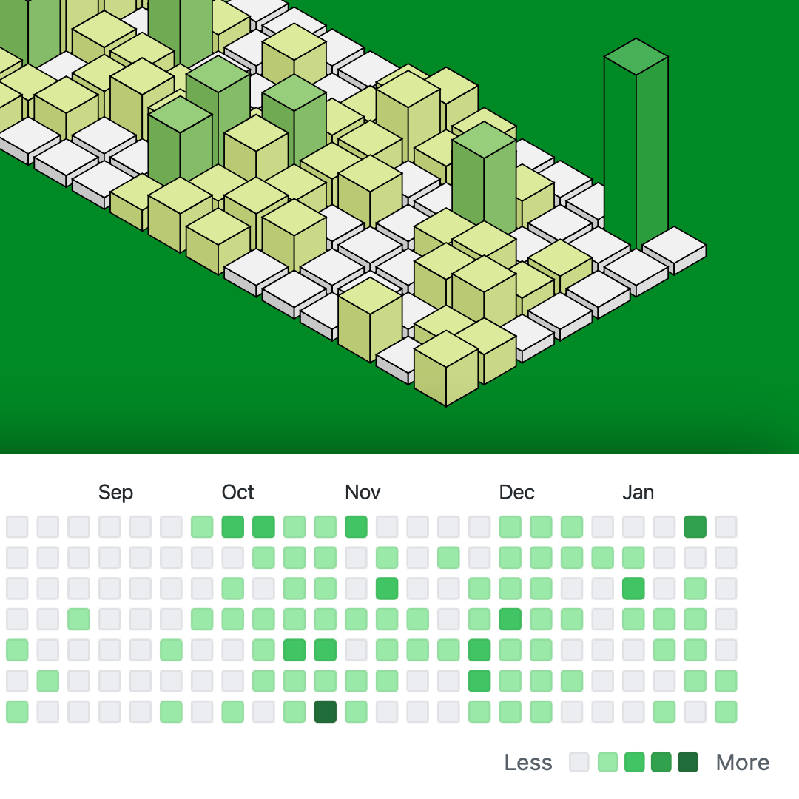

# react-isometric-github-calendar

## Demo

https://mukhindev.github.io/react-isometric-github-calendar/

## What's it?

Isometric Github Calendar with SVG and React.

## How to use?

* Rename file `.env.example` to `.env`. Add your login and token* from GitHub.
* Run `npm start` for developer mode.
* Run `npm run build` for build web-application in directory `build`.

| :warning: Attention! Use only the public GihHub token. Better yet, move the api request to the server. |
| --- |

© Sergey Mukhin 2021 @mukhindev